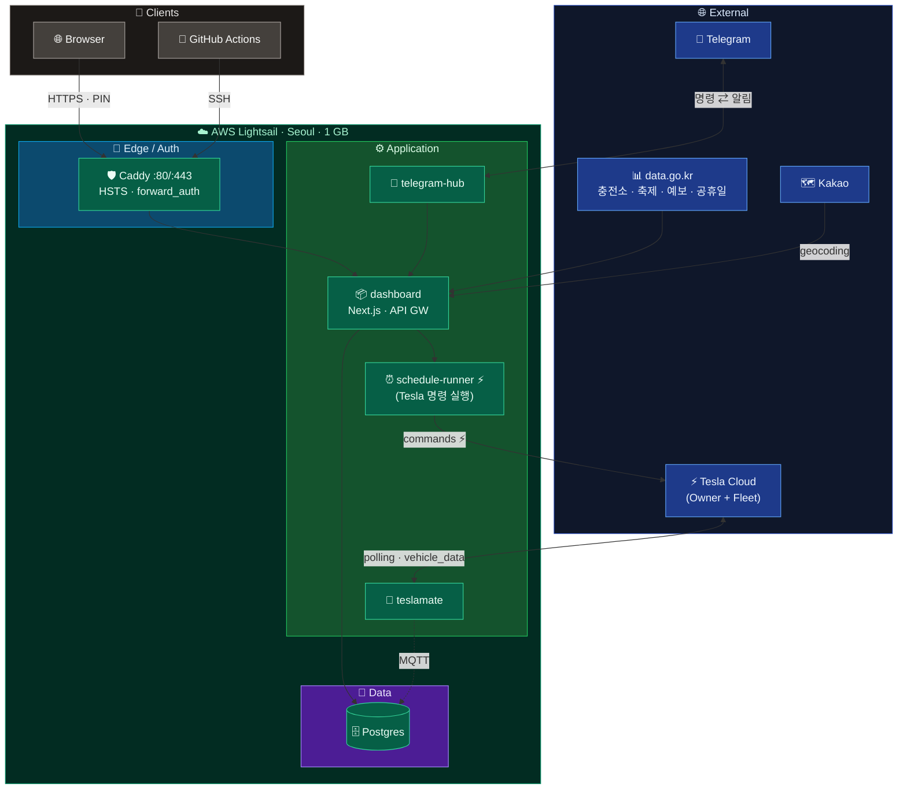

# TeslaMate Custom Dashboard

오픈소스 [TeslaMate](https://github.com/teslamate-org/teslamate) 가 수집한 차량 데이터를 한국어 모바일 UI 로 재구성하고, **Tesla Fleet API · 공공데이터 · 텔레그램 봇**을 단일 게이트웨이 뒤로 통합한 개인 운영 대시보드.

단일 AWS Lightsail 인스턴스(1 GB · 월 $7) 위에 `docker-compose` 5개 서비스로 동작하며, master 푸시마다 GitHub Actions 가 SSH 로 무중단 배포한다.

## 핵심 기능

- **주행** — 차량 KPI · 시간×요일 패턴 · TOP 50 거리/효율 · 연도별 월간 · 계절 분석
- **이력** — 월→주→일 3단 계층 카드 · 일 상세 지도 · 자주 가는 곳 / 오래 머문 곳 토글
- **배터리** — 건강 점수 · 24h 대기 소모 타임라인 · 충전 습관 히트맵 · 급속/완속 위치 클러스터 지도
- **충전소** — 환경공단 API 기반 집 충전기 실시간 + Top 순위 + 활용도 리포트
- **자동화 (Tesla Fleet API)** — 센트리 · 공조 스케줄러 · 즉시 실행 · 월 캘린더 · 사용량 · 비용 대시보드
- **텔레그램 봇 인터페이스** — 사용자 명령 응답(차량 상태 · 충전 · 축제 등) + 푸시 알림(미운행 · 충전 완료 · 장기 주차 등)

## 아키텍처



`IN` = Lightsail 이 받는 데이터 / `OUT` = Lightsail 이 내보내는 데이터.

공공데이터 4종(환경공단 · 한국관광공사 · 기상청 · 한국천문연구원)은 조직은 별개지만 **공공데이터포털(`data.go.kr`)** 단일 게이트웨이를 통해 API 키·요청 형식이 통일된다.

### 엔지니어링 하이라이트

- **API gateway 단일 진실원** — UI · 텔레그램 봇 · 외부 소비자는 모두 `dashboard /api/*` 만 호출. 외부 DB 직접 접근 금지. 스키마 함정/폴백 로직이 한 곳에 모이고, 같은 데이터를 다른 소비자가 다른 쿼리로 보던 불일치를 제거.
- **3단 캐시 전략** — 메모리 TTL(라우트별 15 s~600 s) → DB 사전 집계 테이블(`dash_*`, 매일 04:00 KST cron) → DB 영구 캐시(`kakao_address_cache` 등). 1 GB RAM 인스턴스에서도 12+ 페이지가 즉답.
- **Tesla Fleet API 비용 차단 레이어** — 호출 1 회당 실제 청구(commands $0.001 / vehicle_data $0.002 / wakes $0.02). 사용 범위를 `/v2/schedule` 라우트로 한정, `teslaFetch` 가 path 분류로 자동 카운팅 → `dash_api_usage_monthly`. 결제 수단 미등록 + $10 무료 한도 초과 시 Tesla 측에서 자동 차단(과금 X).
- **보안** — Caddy HSTS + 보안 헤더 / PIN 인증(IP 누적 10 회 실패 시 텔레그램 관리자 알람) / TeslaMate Phoenix UI 는 Caddy `forward_auth` 로 대시보드 인증 통과 시만 노출 / 대시보드 컨테이너 포트는 호스트 loopback 만 바인딩.
- **무중단 자동 배포** — master push → GitHub-hosted runner → SSH → `docker compose up -d --build dashboard` 만 갱신. 다른 서비스는 유지, 빌드 캐시 활용.

## 기술 스택

| 영역 | 사용 |
|---|---|
| 프런트 | Next.js 14 (App Router) · Tailwind CSS 3 · Leaflet 1.9 · 인라인 SVG 아이콘 |
| 백엔드 | Node 20 (ESM) · `pg` 직접 쿼리 · 메모리 LRU · node-cron |
| 데이터 | PostgreSQL 16 (TeslaMate 스키마 + `dash_*` 사전 집계 + 외부 캐시 테이블) |
| 외부 API | Tesla Fleet · 공공데이터포털(환경공단·관광공사·기상청·천문연) · Kakao |
| 인프라 | AWS Lightsail (Seoul · t-micro) · Caddy 2 · docker-compose · GitHub Actions |

## 빠른 시작 (로컬)

`.env` 작성:

```env
TM_DB_USER=teslamate
TM_DB_PASS=<password>
TM_DB_NAME=teslamate
ENCRYPTION_KEY=<openssl rand -hex 32>
# 선택 — 없으면 일부 기능 비활성
KAKAO_REST_API_KEY=...
EV_CHARGER_API_KEY=...
HOME_CHARGER_STAT_ID=<CHARGER_STAT_ID>   # 환경공단 충전소 통계 ID
```

```bash
docker compose up -d
```

TeslaMate 초기 연동은 `http://localhost:4000` 에서 Tesla 계정 로그인.

## 더 보기

- 개발 규칙 · 코드 컨벤션 — [`CLAUDE.md`](./CLAUDE.md)
- 인프라 · 운영 · 배포 · 트러블슈팅 — [`docs/`](./docs/README.md)
- 알려진 함정 (수정 전 필독) — [`docs/PITFALLS.md`](./docs/PITFALLS.md)
